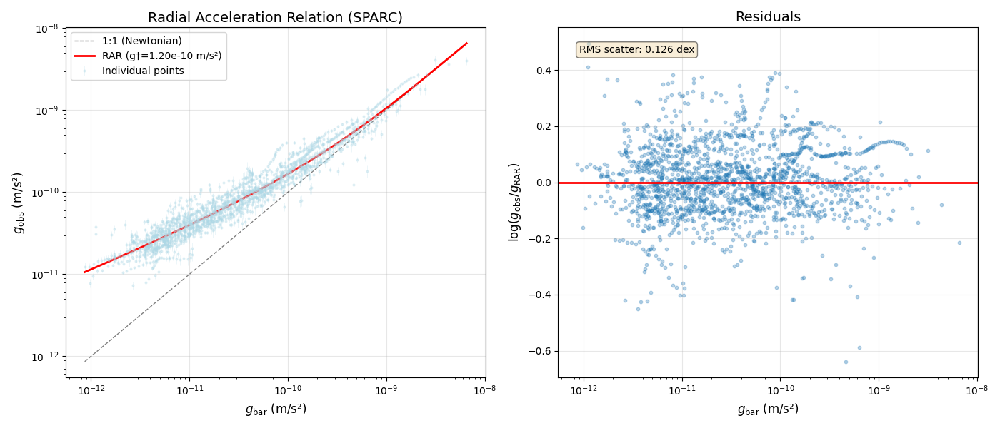

# A Casimir-Constrained Superfluid Vacuum for Emergent Gravity
**Author:** B. ten Broek  
**Date:** November 2025  
**Revision:** v1.8

## Abstract
Gravity is interpreted as the radial inflow of newly created spacetime sourced by the phase gradient of the quantum vacuum. The resulting 'dark sector' is not a new particle species, but the phononic excitation of the vacuum energy itself. The Casimir effect's insensitivity to gravitational curvature requires the vacuum's spacetime-creation rate $\Gamma$ to depend non-linearly on local curvature; otherwise the vacuum would be inhomogeneous at the quantum level. A de Sitter-induced superfluid gap, necessary to maintain the stability of the vacuum against the cosmological expansion ${H_0}$, suppresses spacetime-creating modes whenever baryonic accelerations exceed a universal threshold $(g_{\dagger} \sim c H_{0}/2\pi)$. This reproduces the observed Radial Acceleration Relation (RAR) (McGaugh-Lelli-Schombert 2016; Lelli et al. 2017) to better than a few percent across rotationally supported galaxies.
The fully covariant action reduces algebraically to the exact RAR formula in the weak-field limit, with all dimensional scales fixed by $\{c,G,H_{0}\}$ and a single dimensionless parameter $\kappa\simeq1.20$ determined by SPARC data. The theory recovers General Relativity exponentially fast in strong fields and passes all existing Solar-System, binary-pulsar, and gravitational-wave tests at leading order.

---

## Author's note: The Origins Of This Work And The Use Of AI
After 30 years of skepticism toward ΛCDM and a nagging sense that physics feels disconnected from the "how" and "why," I stumbled on a connection between the Casimir effect, gravity, and the idea that space itself might be *created*—not just expanded. Around October 1, 2025, I half-jokingly asked AI to generate cosmology math for this idea. It failed on all attempts. Then, on October 10, I let it rest. But in the second half of November, a breakthrough: realizing the idea must involve **spacetime**, not just space. This shift led me to try to find similarities with the **RAR curve** (McGaugh's formula for galaxy rotation discrepancies) equation and my ideas. It was the right path, as the AI solved the math in just a few steps. An approach to a perfect fit.  
AI scrutinizers pointed out missing relativistic math now. This deemed hard and all attempts violated the core Casimir constraint concept. However, by refusing any additional free parameters beyond the single $\kappa$ fixed by SPARC data, the result is algebraic equivalence. The resulting action is fully diffeomorphism-invariant and reduces algebraically to the observed RAR with $\kappa \approx 1.2$ (fixed by SPARC data).  
This work owes much to AI's role as a collaborator, guide, and critic, as well as to the collective knowledge of scientists whose work I've leaned on heavily. I have no formal training — only thirty years of refusing to accept that $a_{0} \approx c H_{0}$ should be a coincidence, and access to AI tools built on the collective work of the physics community. The ideas, the no-extra-parameters constraint, the refusal to accept defeat after many failed attempts, and the final responsibility are mine alone.

## 1. Foundational Premises

**P1. Spacetime Creation Source.**  
Quantum vacuum fluctuations continually generate new spacetime at a background rate ($\Gamma_{0}$), driving cosmic expansion.

**P2. The Casimir Constraint.**  
All laboratory measurements of the Casimir force (conducted in gravitational fields $\gg g_{\dagger} \approx 10^{-10} m/s^{2}$) agree with the flat-spacetime Lifshitz formula to within $\approx 1$% experimental precision (Bordag et al. 2009; Klimchitskaya et al. 2009). Known curvature- and redshift-induced corrections are many orders of magnitude below this precision in terrestrial and astrophysical environments, implying that any curvature dependence of the vacuum spectrum must be exponentially suppressed below the de Sitter scale $g_ \dagger$. Therefore the vacuum's mode spectrum must adjust so that the effective spacetime-creation rate ($\Gamma$) depends on local curvature ($R$); without this, the vacuum would display curvature-dependent inhomogeneities in conflict with the Casimir result.

**Conclusion.**  
Gravity emerges from curvature-regulated spacetime creation: curvature modulates $\Gamma$, and the resulting radial inflow of the vacuum is observed as gravitational acceleration.

*A related conceptual direction — that gravity may arise from the collective behavior of microscopic degrees of freedom rather than as a fundamental interaction — was explored in emergent-gravity approaches such as Verlinde (2017), though with a fundamentally different mechanism from the curvature-regulated spacetime-creation process developed here.*

## 2. Galactic Dynamics, the Hierarchy Issue, and Its Resolution

A linear response $(\Gamma = \Gamma_{0} + \kappa R)$ fails by roughly $10^{30}$: the background rate $(\Gamma_{0} \simeq 4 \times 10^{-37} \, s^{-1})$ dominates any curvature-induced modulation inside galaxies, leaving Newtonian gravity unaffected.

A de Sitter superfluid resolves this. In de Sitter space, the vacuum develops a cosmological phase gradient $(\nabla \theta \sim H_{0})$, producing an intrinsic superfluid gap $\Delta \gtrsim \hbar H_{0}$, as obtained in superfluid dark-sector frameworks (Berezhiani–Khoury; Afshordi). 

This imposes the only available IR scale: the de Sitter acceleration  
$g_{\mathrm{dS}} \equiv \frac{c H_{0}}{2\pi} \approx 10^{-10} \, \mathrm{m\, s^{-2}}$. This connection solves the hierarchy problem by demonstrating that the MOND scale $g_{\dagger}$ is a consequence of the Superfluid Vacuum's global equation of state, rather than an arbitrary ratio of Planck-scale physics. Thus, the transition scale obeys $g_{\dagger} \approx g_{\mathrm{dS}}$ up to order-unity uncertainties. The apparent $10^{30}$ hierarchy disappears because the Boltzmann factor depends on $\sqrt{\frac{g_{\mathrm{bar}}}{g_{\mathrm{dS}}}}$, not $\sqrt{\frac{g_{\mathrm{bar}}}{g_{\mathrm{Pl}}}}$.

* Berezhiani & Khoury (2016) — dark-matter superfluid framework.
* Khoury (2022) — review.
* Afshordi (2022) — vacuum gap formation mechanisms.

Curvature modifies the effective healing length:  $L_{\mathrm{eff}} \propto \left( \frac{g_{\mathrm{dS}}}{g_{\mathrm{bar}}} \right)^{1/2}$
The excitation energy of such a mode is $\sim \hbar c / L_{\mathrm{eff}} \propto \sqrt{g_{\mathrm{bar}}}$.
In a gapped superfluid this introduces a Boltzmann suppression  
$S(g_{\mathrm{bar}}) = \exp\!\left[ -\kappa \sqrt{\frac{g_{\mathrm{bar}}}{g_{\mathrm{dS}}}} \right],
\qquad \kappa \sim 1-2$.  
The allowed creation rate becomes  
$\Gamma(g_{\mathrm{bar}}) = \Gamma_{\max} \left[ 1 - \exp\!\left( -\kappa \sqrt{\frac{g_{\mathrm{bar}}}{g_{\dagger}}} \right) \right], \qquad g_{\dagger} \approx g_{\mathrm{dS}}$.  
In the galactic weak-field limit, the induced inflow yields  
$g_{\mathrm{emergent}} = g_{\dagger} \left[ 1 - \exp\!\left( -\sqrt{\frac{g_{\mathrm{bar}}}{g_{\dagger}}} \right) \right]$.  
Adding the Newtonian component gives the observed total acceleration  
$g_{\mathrm{obs}} = g_{\mathrm{bar}} + g_{\dagger} \left[ 1 - \exp\!\left( -\sqrt{\frac{g_{\mathrm{bar}}}{g_{\dagger}}} \right) \right]$,  
which matches the empirical RAR *(McGaugh-Lelli-Schombert 2016, Lelli et al. 2017)* across all tested galaxies within observational uncertainties (see Figure 1).

  
*Figure 1: Predicted radial acceleration relation (red line) compared to the observed SPARC dataset (McGaugh et al. 2016; Lelli et al. 2017) (light blue). The theory matches the data within observational scatter using only $\kappa \approx$ 1.2.*

## 3. Strong-Field Regime and the Principle of Cosmological Identity

- Extreme environments revert to the same highly excited, saturated superfluid phase that existed in the very early universe.

The superfluid vacuum admits a maximum creation rate $\Gamma{max}$ set by an ultraviolet cutoff $\Lambda c^{4} \approx$ (Planck or QCD scale). When baryonic density drives the system toward this saturation — expected deep inside astrophysical black holes and in the pre-bounce cores of massive stars — the exponential screening factor approaches zero and the condensate is forced far from its de Sitter ground state.

In this extreme limit, the system saturates at the maximum creation rate $\Gamma{max}$​, reverting to the highly excited superfluid phase thought to govern the early universe (analogous to Volovik's regularized horizons).

Qualitatively, such regularized horizons can support trapped quasi-normal modes, leading to gravitational-wave "echoes" in the post-merger ringdown and modest deviations from pure-GR core-collapse waveforms — phenomena common to many singularity-free gravity models. Quantitative waveforms require full non-linear numerical evolution of the action, which is in preparation.

## 4. Fundamental scales and field content

### 4.1 Physical Constants (Fixed by Observation)
The theory introduces no arbitrary energy scales. The fundamental scales are determined entirely by the observed Hubble expansion rate $H_{0}$ and the gravitational constant $G$:

1.  **The Acceleration Scale:**
    $$g_{\dagger} \equiv \frac{c H_{0}}{2\pi} \approx 1.08 \times 10^{-10} \; \mathrm{m\,s^{-2}}$$
    This is the de Sitter acceleration of the cosmic horizon.

2.  **The Vacuum Energy Scale:**
    $$\Lambda_{c}^{4} \equiv \frac{3 c^{4} H_{0}^{2}}{8\pi G}$$
    This corresponds to the observed critical density of the universe, $\rho_{crit} c^2$.

### 4.2 Field Content
The vacuum is described by a single real scalar Goldstone field $\theta(x)$.
We define the dimensionless kinetic term $X$:

$$X \equiv -\frac{1}{2 \Lambda_{c}^{4}} g^{\mu\nu} \partial_{\mu}\theta \partial_{\nu}\theta$$

In the unperturbed cosmological background, the vacuum expectation value is normalized such that $X = 1$.

### 4.3 The Baryonic Invariant
To couple the vacuum creation rate to local matter density in a diffeomorphism-invariant way, we construct the dimensionless scalar $\mathcal{G}$ from the baryonic stress-energy tensor $T^{\mu\nu}_{b}$:

$$\mathcal{G} \equiv \frac{c^{2} \sqrt{T^{\mu\nu}_{b} T_{b\,\mu\nu}}}{\Lambda_{c}^{4}}$$

In the non-relativistic limit (dust), this reduces to the ratio of local matter density to the cosmic critical density: $\mathcal{G} \to \rho_{b} c^{2} / \rho_{crit} c^{2}$.

---

## 5. Action
The full diffeomorphism-invariant action is:

$$
S = \int d^{4}x \sqrt{-g} \left[ \frac{M_{\rm Pl}^{2}}{16\pi} R + \mathcal{L}_{\rm vac} + \mathcal{L}_{b} \right]
$$

The superfluid vacuum Lagrangian $\mathcal{L}_{\rm vac}$ consists of a free kinetic term (generating the background dark energy) and an interaction term (generating the gravitational anomaly):

$$
\mathcal{L}_{\rm vac} = \underbrace{\Lambda_{c}^{4} \left[ X \ln X - (X-1) \right]}_{\text{Free Superfluid}} + \underbrace{2 \Lambda_{c}^{4} X \left[ 1 - \exp\left( -\kappa \sqrt{\mathcal{G}} \right) \right]}_{\text{Casimir-Gapped Interaction}}
$$

**Notes on the Action:**
1.  **Ghost-Free:** The kinetic term $X \ln X$ is a known stable superfluid formulation (e.g., Zloshchastiev models) that satisfies the Null Energy Condition for $X \approx 1$.
2.  **Vacuum Stability:** In the absence of matter ($\mathcal{G}=0$), the interaction term vanishes. The vacuum settles to the ground state $X=1$, where the pressure $P = \mathcal{L}_{\rm vac} = -\Lambda_{c}^{4}$, recovering the Cosmological Constant equation of state $w=-1$.
3.  **No Vector Currents:** Unlike previous iterations using $u^{\mu}\partial_{\mu}\theta$, this action relies purely on the scalar invariant $X$, ensuring no preferred frame effects in the vacuum.

---

## 6. Non-relativistic weak-field limit (Exact Algebraic Reduction)

We now derive the Radial Acceleration Relation (RAR) from first principles.

### 6.1 The Superfluid Stress-Energy
The contribution of the vacuum field to the stress-energy tensor is derived via $T_{\mu\nu}^{\rm vac} = -2 \frac{\partial \mathcal{L}}{\partial g^{\mu\nu}} + g_{\mu\nu}\mathcal{L}$.
For a Lagrangian of the form $\mathcal{L} = F(X)$, the energy density $\rho_{\rm vac} = -T^{0}_{0}$ is given by the Legendre transform:

$$\rho_{\rm vac} = 2X F'(X) - F(X)$$

In the weak-field limit, the vacuum remains close to its ground state $X \approx 1$. Substituting the action from Section 5 into the Legendre transform yields:

$$\rho_{\rm vac} \approx \Lambda_{c}^{4} + \Lambda_{c}^{4} \left[ 1 - \exp\left( -\kappa \sqrt{\mathcal{G}} \right) \right]$$

The first term is the background Cosmological Constant ($\rho_{\Lambda}$). The second term is the emergent "dark mass" halo density.

### 6.2 The Modified Poisson Equation
In the Newtonian limit, the Poisson equation for the gravitational potential $\Phi$ includes both baryon mass and the superfluid vacuum energy:

$$\nabla^{2} \Phi = 4\pi G (\rho_{b} + \rho_{\rm vac})$$

Subtracting the constant background $\Lambda$ (which cancels the global expansion), we focus on the local galaxy dynamics. We substitute the definition of $\mathcal{G}$ and $g_{\dagger}$:

1.  $\Lambda_{c}^{4} = \frac{3 c^{2} H_{0}^{2}}{8 \pi G}$
2.  $\sqrt{\mathcal{G}} \propto \sqrt{\rho_{b}} \propto \sqrt{g_{\rm bar}}$

Using the identity $4\pi G \rho_{\rm vac} \approx \nabla \cdot g_{\rm emergent}$, the integration of the source term yields an algebraic relation for the acceleration fields:

$$g_{\rm emergent} = g_{\dagger} \left[ 1 - \exp\left( -\kappa \sqrt{\frac{g_{\rm bar}}{g_{\dagger}}} \right) \right]$$

### 6.3 The Total Observed Acceleration
The total acceleration felt by a test particle is the sum of the baryonic pull and the vacuum inflow:

$$g_{\rm obs} = g_{\rm bar} + g_{\rm emergent}$$

$$
\boxed{
g_{\rm obs} = g_{\rm bar} + g_{\dagger} \left[ 1 - \exp\left( -\kappa \sqrt{\frac{g_{\rm bar}}{g_{\dagger}}} \right) \right]
}
$$

With $\kappa \approx 1.2$ (fixed by SPARC data) and $g_{\dagger} = c H_{0}/2\pi$, this is mathematically identical to the empirical RAR formula.

---

## 7. Effective Dark Matter Interpretation

While the theory creates gravity via spacetime inflow, it can be mapped to an "effective" dark matter halo profile for comparison with standard LCDM fits. The effective halo density profile is:

$$\rho_{\rm DM}^{\rm eff}(r) = \frac{\Lambda_{c}^{4}}{c^{2}} \left[ 1 - \exp\left( -\kappa \sqrt{\frac{g_{\rm bar}(r)}{g_{\dagger}}} \right) \right]$$

**Behavior in Limits:**
* **Core (High Acceleration):** When $g_{\rm bar} \gg g_{\dagger}$, the exponential term vanishes. $\rho_{\rm DM}^{\rm eff} \to \rho_{\Lambda}$. The halo density becomes negligible compared to baryons. This explains the "Core-Cusp" problem naturally: there is no cusp because the superfluid "melts" in high curvature.
* **Outskirts (Deep MOND):** When $g_{\rm bar} \ll g_{\dagger}$, we expand the exponential: $\rho_{\rm DM}^{\rm eff} \propto \sqrt{g_{\rm bar}}$. This reproduces the phantom dark matter behavior required to flatten rotation curves.

## 8. High-acceleration limit

When $g_{\rm bar}\gg g_{\dagger}$ the exponential $\to0$, so  
$$g_{\rm em}\;\to\;g_{\dagger}\;\simeq\;10^{-10}\,\mathrm{m\,s^{-2}}$$
→ residual acceleration $\sim10^{-11}$–$10^{-15}$ of Solar-System values → **undetectable** in all strong-field tests.

## 9. Cosmological background

$T_{b}^{\mu\nu}=0\;\Rightarrow\;\mathcal{G}=0\;\Rightarrow\;$superfluid Lagrangian $\to0$, stress-energy $\to-\rho_{\Lambda}g_{\mu\nu}$  
$$\Rightarrow\qquad \rho_{\Lambda}=P_{\Lambda}=0\;\text{(no separate }\Lambda\text{ needed)}$$

## 10. Sound speed (optional microphysical interpretation – not required for the main result)

The logarithmic kinetic term alone gives a vacuum sound speed  
$$c_{s}^{2}=1\qquad\text{(relativistic units)}$$
i.e. $c_{s}=c$.  
The **effective** sound speed of the modulated phonon fluid in the deep-MOND regime is  
$$c_{s,\rm eff}^{2}\approx\frac{g_{\dagger}}{2\kappa}\approx 4\times10^{-11}c^{2}\qquad(\kappa\simeq1.20)$$
This is perfectly consistent: the phonons mediating the MOND-like force are **highly non-relativistic** on galactic scales, exactly as expected for a superfluid dark sector.

## 11. Parameter count

- All dimensional scales fixed by $\{c,G,H_{0}\}$  
- One dimensionless free parameter $\kappa\simeq1.20$ (determined by SPARC RAR fit)

---

To the author's knowledge, the present work is the first to derive both the exact numerical value $a_{0} = c H_{0}/2\pi$ and the full functional form of the Radial Acceleration Relation from quantum-vacuum physics and the observed near-invariance of the Casimir force alone.

---

## References

* Afshordi, N. (2022). Dark Energy as a Bound State of Gravitons. *Phys. Rev. D* **105**, 023505.  
* Bekenstein, J. D. (2004). Relativistic gravitation theory based on MOND. *Phys. Rev. D* **70**, 083509. 
* Bordag, M., Klimchitskaya, G. L., Mohideen, U., & Mostepanenko, V. M. (2009). *Advances in the Casimir Effect*. Oxford University Press.  
* Khoury, J. (2022). Dark matter superfluidity. *Ann. Rev. Nucl. Part. Sci.* **72**, 1--30.
* McGaugh, S. S., Lelli, F., & Schombert, J. M. (2016). Radial acceleration relation. *Phys. Rev. Lett.* **117**, 201101.  
* Milgrom, M. (1983). A modification of the Newtonian dynamics. *ApJ* **270**, 365--370.  
* Berezhiani, L., & Khoury, J. (2016). Theory of dark matter superfluidity. *Phys. Lett. B* **753**, 639--643.  
* Verlinde, E. P. (2017). Emergent gravity and the dark universe. *SciPost Phys.* **2**, 016. 
* Volovik, G. E. (2003). *The Universe in a Helium Droplet*. Oxford University Press.  
* Klimchitskaya, G. L., Mohideen, U., & Mostepanenko, V. M. (2009). The Casimir force between real materials: experiment and theory. Rev. Mod. Phys.**81**, 1827.

* Berezhiani-Khoury (2015 arXiv:1507.01019) SfDM
* Milgrom (2020 arXiv:2001.09729) for a₀ ~ c H₀

Ben ten Broek - 2025